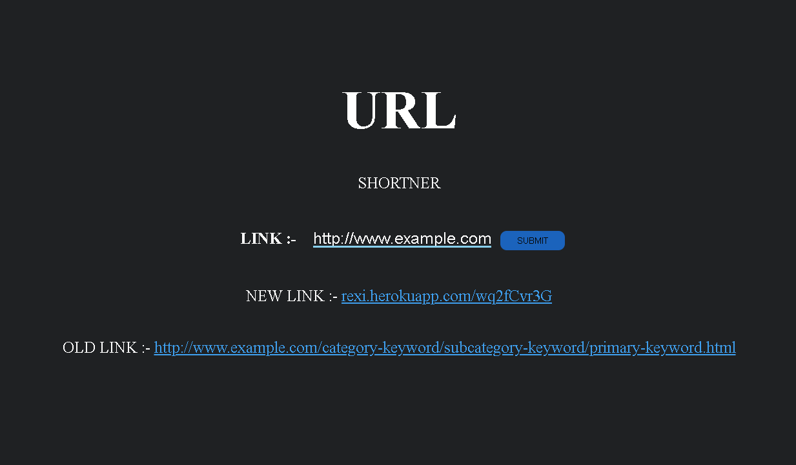

# URL SHORTNER
This application is developed using Express JS(Node JS Framework) and EJS(Template Engine). For database, I have used Mongo DB.

This application will help in shrinking or shortning very long URLs into working small URL.

##### Link To The Project :- <a href='https://rexi.herokuapp.com/'>URL SHORTNER</a>

## DEMO

